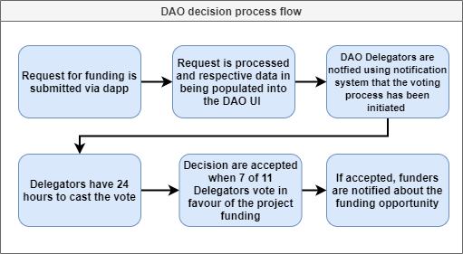

# DAO end to end process
### DAO is designed to incentivize making decisions in self-interest and the best interest of the DAO at the same time.
<!---  --->

## DAO Ecosystem actors:
| DAO Actors     | How to become                                                                              | Function                                                                                                                                                                                                             | Incentives                                                                                                                             |   |
|----------------|--------------------------------------------------------------------------------------------|----------------------------------------------------------------------------------------------------------------------------------------------------------------------------------------------------------------------|----------------------------------------------------------------------------------------------------------------------------------------|---|
| ALBT Stakers   | Stake 5000 Every user who is willing to stake ALBT tokens                                  | - secure the network                                                                                                                                                                                                 | - receive the network fees                                                                                                             |   |
| DAO Members    | Stake 50000 ALBT Request the smart contract to receive a non-tradable DAO token 50 Members | - vote on DAO delegators                                                                                                                                                                                             | - receive the network fees - receive the fraction of generated interests                                                               |   |
| DAO Delegators | Stake 250000 ALBT 11 DAO Members with highest vote number                                  | - provide assistance in project onboarding - reviewing the business plan - Request for funding advisory - voting on project funding - voting on tranche unlocking - voting on reaching the Maturity Date decisions   | - receive the network fees - receive the fraction of generated interests  - receive the fraction of initial fee paid by the project    |   |
| DAO Substitute | Stake ALBT DAO Members with highest vote number starting from 11 place on the leaderboard  | - jumps in as a substitute for a lazy voter                                                                                                                                                                          | - receive the network fees - receive the fraction of generated interests - receive additional fees when promoted to Delegator or Juror |   |

### External dispute resolution implemented with Kleros arbitration process:

Integration - https://kleros.io/integrations/ 

## ERC-792: Arbitration Standard 
Standard way to create interoperable arbitration on Ethereum. The standard consists of two types of smart contracts: Arbitrable and Arbitrator. Arbitrable contracts send enforceable disputes to the Arbitrator smart contract, which comes up with a ruling and sends it back to the Arbitrable contracts, which then enforce the decision. ERC-792 provides basic functions to allow smart contracts to interact with the Kleros Court and other arbitrators. It provides a standardized flow for disputes and enforcement of rulings.

## ERC-1497: Evidence Standard
The ERC-1497 consists of two categories of information: evidence and meta-evidence. Evidence, as the name hints, is a piece of information that supports a proposition. Meta-evidence, on the other hand is the information about the dispute itself, the agreement, parties involved, ruling options, and others.

## Archon
Javascript library written to make it easy to interact with Arbitrable and Arbitrator contacts. In particular, Archon can be used to take care of a lot of the hash validation work that is part of the Evidence Standard (ERC 1497). Archon can be used with all Arbitrable and Arbitrator contracts that follow the ERC 792 standard and has the functionality to interact with all standardized methods.

### https://kleros.io/static/whitepaper_en-8bd3a0480b45c39899787e17049ded26.pdf
1. Any decentralized or centralized project can integrate Kleros as the dispute resolution layer. 
2. Kleros is a plug-in decentralized court system. Smart contracts have to designate Kleros as their arbitrator. 
3. When the project wants to use Kleros plug-in, the project chooses how many jurors and which court will rule their contract in case a dispute occurs.
4. There are different types of courts specialized in the topic of the dispute.
5. The project will specify the options available for jurors to vote.
6. Users have an economic interest in serving as jurors in Kleros.
7. The probability of being drawn as a juror for a specific dispute is proportional to the number of tokens a juror stakes, however, the final juror’s selection is done randomly.
8. Projects plugged into Kleros need to provide evidence from both sides of the conflict.
9. The probability of being drawn as a juror for a specific dispute is proportional to the number of tokens a juror stakes.
10. After assessing the evidence, jurors commit their vote to one of the options.
11. After all, jurors have voted (or after the time to vote is over), votes are revealed by jurors. 
12. Jurors that fail to reveal their vote are penalized. 
13. Finally, votes are aggregated and the smart contract is executed. 
14. The option with the highest amount of votes is considered as the winning one.
15. Each juror who is coherent with the final ruling will be paid an arbitration fee. 

## Off-chain ( contact point - DAO delegators via offline communication channel )

### Application process
1. Business plan presentation 
    * Executive summary
    * Company description
    * Market analysis
    * Organization and management
    * Service or product line
    * Marketing and sales
    * Funding request
    * Financial projections
2. Screening
    * Screening due diligence
    * Business due diligence
    * Legal due diligence
3. Negotiation 
    * Milestones negotiation
    * Loan economics
    * Token sale economics
4. Request for funding
    * Request for funding draft assistance

## On-chain

### Voting and participation - overall voting rules
* Delegators have 24 hours to cast the vote
* After 24 hrs if no vote Delegator lose his status
* DAO Member from the DAO Leaderboard jumps in as a substitute and becomes DAO delegator
* Lazy Delegator is banned from voting for Delegators for the next month
* Decision are accepted when 4 of 7 Delegators vote in favour of the decision 

### Initial project voting
1. Dao Delegators vote for accepting project
    * If project is accepted DAO triggers lending process that leads to NFT mint

### Milestone voting
1. Dao Delegators vote for unlocking the tranches
    * Tranches delivery vote
    * Milestone delivery period extension
    * Voting to unlock tranche for the project on exceptional basis when Milestone not delivered 
    * Funding tranche is unlocked from the escrow and sent to the Project

### Arbitration & Conflict resolution 

1. Project not deliver the Milestones
    * Dispute resolution process is initiated (Governed by DAO Jurors)
    * O Jurors are 7 DAO Members elected in the same manner as DAO Delegators
    * DAO Jurors task is to adjudicate the correctness of the decision regarding funding 
    * DAO Jurors reviews the evidence 
    * Juror have 72 hours to review the evidence, if not Juros lost his status 
    * Case outcome is decided with the decision of majority of Jurors
    * Jurors who vote coherently receive Juror fee

### Project cannot repay the funding
1. DAO Delegators are voting on the project future regarding repayment
    * Vote on calling a loan, and trigger liquidation process
    * Vote on Maturity Date extension
    * Vote on loan reschedule