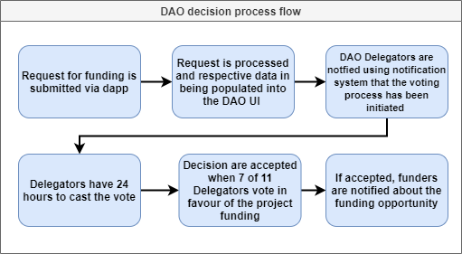

# DAO: Decentralized Autonomous Organization
### *The DAO operates through Governance, so we will use these terms interchangeably*

## What is DAO and how does it work?

**DAO** is an organization designed to be automated and decentralized. In this case, the *DAO*  is composed by a series of Governance *Smart Contracts* that are designed in 6 phases that are designed to last roughly one month:

1. **Phase 1:**  *ALBT* holders may stake 5k ALBT to bnecome [**stakers**]().
2. **Phase 2:**
    1. [**Governance**]() executes the function [`openDaoMembershipSubscriptions()`]()
    2. [**Stakers**]() are invited to subscribe to become *DAO members*. In order to do so, they must have staked an extra 45k *ALBT*.
3. **Phase 3:**
    1. [**Governance**]() executes the function [`openDaoMembershipVoting()`]()
    2. Now [**Stakers**]() (Phase 1) and [**DAO Subscribers**]()(Phase 2) can vote for which of the [**subscribers**]() they want to become DAO members.
    3. If a [**subscriber**]() becomes [**Active Dao Member**](), their 50k *ALBT* are locked for a month.
4. **Phase 4:**
    1. [**Governance**]() executes the function [`openDaoDelegatingSubscriptions(N = amount of DAO members)`]()
    2. Then the top *N* voted [DAO membership subscribers]() become [Active DAO members]()
    3. Now the *N* [**Active DAO members**]() can subscribe to become *DAO Delegators*. In order to do so, they must have staked an extra 200k *ALBT*.
5. **Phase 5:**
    1. [**Governance**]() executes the function [`openDaoDelegatingVoting()`]()
    2. Only the [**Active DAO Members**]() are voting for whom of the [**DAO Delegator Subscribers**]() they want to become [**Active DAO Delegators**]().
    3. **This voting process is secret.** [**Active DAO Members**]() vote by passing a hash of the password plus the address of the [**DAO Delegator Subscriber**]() they wish to vote for. After this, the voter has to approve his vote in a different transaction.
6. **Phase 6:**
    1. [**Governance**]() executes the function [`openDaoDelegating(M = amount of DAO Delegators)`]()
    2. The top *M* [**DAO Delegator Subscribers**] become [**Active DAO Delegators**]()

------------------
## More on the six phases system:

Every month this cycle repeats:
* The users can stake to become **Stakers**.
* **Stakers** can subscribe to become **Membership subscribers**.
* **Membership Subscribers**, **Active Members**, and **Active Delegators** can vote for **Membership Subscribers** to become **Active Members**.
* **Active Members** can subscribe to become **Active Delegators**.
* **Active Members** and **Active Delegators** can vote for **Delegator Subscriber** to become the new **Active Delegators**.

## Monthly time cycle for Active Members:
* 25 days for voting on becoming a Dao Member. (voting)
* 3 days for claiming the Dao membership (claim_membership)
* 2 days for the remaining spots to be filled (late_membership_claiming)

## Monthly time cycle for Delegators:
* 20 days for active Dao Members for voting on becoming a Dao Delegator. (voting)
* 5 days for passing the passwd+addr and approve vote(approve_vote)
* 3 days for claiming the Dao Delegation (claim_delegation)
* 2 days for the remaining spots to be filled (late_delegation_claiming)

---

## How to become a dao member:
1. Stake 5k ALBT
2. Become DAO Member Subscriber by staking an extra 45k ALBT
3. Become elligible for Active DAO Membership through voting (being the top N spots) or if somebody doesn't claim their membership and you are the next elligible in line.
4. Claim your Active Dao Membership.

## How to become a dao delegator:
1. Become Active DAO Member
2. Become a DAO Delegator Subscriber by staking an extra 200k ALBT
3. Become elligible for Active DAO Delegator through voting (being the top M spots) or if somebody doesn't claim their delegator spot and you are the next elligible in line
4. Claim your Active DAO Delegator position

---

---
# Extra notes:
* If you are an Active DAO Member and you don't vote for DAO Delegator Subscribers, you have a penalty: you don't receive rewards plus you cannot become an Active DAO Member the nextMonth.

* If someone is voted for becoming an Active DAO Delegator but is not voted to become Active DAO Member for next month, they will become elligible to become both Active DAO Member and Active DAO Delegator, since a DAO Delegator must also be a DAO Member.

* If an **Active DAO Delegators** won't vote for the project requests, **they loose their rewards and they cannot become Active DAO Delegator next month**.

* The *end-to-end* Financing process is documented [here](Financing.md)