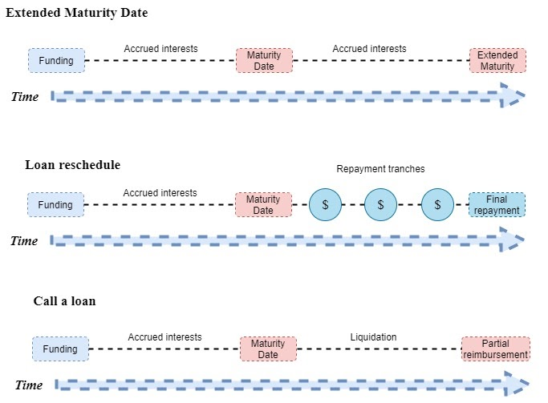

# FAQs

## What is ALBT?
*ALBT* represents the first globally compliant decentralized capital market. You can read more about this [here](https://blog.allianceblock.io/the-allianceblock-albt-token-economy-explained-3b88d4637245)

## What is rALBT?
*rALBT* is the **Reputation Token** that users of [the Protocol](Glossary.md) can farm, hold, and eventually trade in order to earn investment opportunities.

## What is Reputation?
*Reputation* is a sub-system that encourages users to partake in the *Protocol*. You can read more about this [here](RALBT.md)

## What is a Ticket and what rights do I get?
Note that not all **Funders** who *subscribed* to an investment opportunity are eligible to fund a **Project** or **Loan**. Only **Subscribers** with a **Funder ticket** are eligible. In order to earn one, they must win the [Ticket Lottery](Glossary.md). You can read more about this [here](Financing.md)

## How convertible notes work?
Convertible notes are originally structured as debt investments but have a provision that allows the principal plus accrued interest to convert into an equity investment at a later date.
* Are essentially a hybrid of debt and equity
* Are debt instruments that include terms like a maturity date, an interest rate
* Will convert into equity if a future equity round is raised
Convertible Note Economics

## What Happens If the Maturity Date is reached prior to raising money in equity round?
The project gets reverted, and [the Escrow](Escrow.md) unlocks the funds for investors and [Seekers](Glossary.md) to re-claim.

## Can Investors call off a loan?
Investors can demand loan repayment, however since the startup was not able to raise equity, investors would not receive their cash back, or will receive only a worthless fraction of the investment.

## Could the maturity date be extended?
Investors can agree to extend the maturity date and continue accruing interest. This gives a startup time for growth and the possibility to receive financing.

## Enter into the repayment schedule  - TODO
The startup will repay the notes in tranches over an agreed period of time. By paying the loan in tranches, the company can repay the loan without going out of business.
What mechanism should be introduced in case of a product not delivering - solution proposal

## AllianceBlock decentralized app can provide funding for projects that:
1. Will conduct Token Generation Event along with funding process via AllianceBlock
2. Project already has a Token and is seeking to find liquidity. The project is willing to sell a certain part of tokens at a discount in order to receive financing for project growth.

