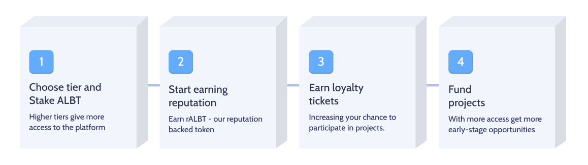

# How Crypto Startup Projects get financed

## Scenario
A project that needs funding for launching an ERC-20 token usually seeks investors or runs an [ICO](Glossary.md#ico) or [IDO](Glossary.md#ido). We call this a [Seeker](Glossary.md#seeker) Project. The **Seeker** will have to go through several stages in order to receive the [funds](Glossary.md#investment-funds) required. In this document we will explain how the protocol works.

---

## From the Seeker's perspective

1. **Request stage:** The [Seeker](Glossary.md#seeker) will start by [Requesting Investment](Glossary.md#request-investment). This request consists of several parts
    * [Hard data](Glossary.md#hard-data) regarding the project.
    * A general Project Description.
    * Token sale, previously generated by the [Seeker](Glossary.md#seeker) on a [TGE](Glossary.md#tge) being transferred to the [Escrow](Escrow.md).

2. **Review stage:** The [DAO](DAO.md) will review the [Investment IDO Request](Glossary.md#request-investment) and decide whether to approve it or not.
    * **If the DAO decides not to approve,** the [Seeker](Glossary.md#seeker) will receive a notification and they will be able to claim back their [investment tokens](Glossary.md#investment-tokens) from the [Escrow](Escrow.md).
    * **If the DAO decides that it is worth investing in**, the [Seeker](Glossary.md#seeker) will be notified and a **Funding Stage** begins.

3. **Listing stage:** At the start of the funding process, the [Investment IDO](Glossary.md#ido) will become [listed](Glossary.md#listing) on the website. Potential [Funders](Glossary.md#funder) will receive a notification via e-mail, encouraging them to sign-in to their accounts and [Subscribe](Glossary.md) to the investment opportunity.

4. **Claiming stage:** After the [Investment goals](Glossary.md#hard-data) have been reached and all of the [Funders](Glossary.md#funder) have purchased their [Funding NFT](Glossary.md#funding-nft), the **Funding Stage** is closed. [Funders](Glossary.md#funder) are now able to claim the [Investment Token](Glossary.md#investment-token) and [Seekers](Glossary.md#seeker) are able to claim their [Investment raised Funds](Glossary.md#investment-funds) from the [Escrow](Escrow.md).

---

## From the Funder's perspective:

1. **Subscribing stage:** When a user sees a [listed](Glossary.md#listing) [investment opportunity](Glossary.md#ido), they choose how much [ALBT](Glossary.md#albt) they want to stake, effectively earning a [Tier NFT](Glossary.md#tier-nft).

2. **Reputation Building** Users earn [Reputation](Reputation.md) by participating to increase their chances in the upcoming [Lottery](Glossary.com#investment-ticket-lottery)

3. **Subscription stage** Users become [Subscribers](Glossary.md#subscribing) by declaring their intention to invest. This requires them to deposit [funds](Glossary.md#funding-token) to the [Escrow](Escrow.md). In effect, they subscribe to an [Investment IDO](Glossary.md#ido) for a chance at winning a [Funder Ticket](Glossary.md#funder). Subscribing is a declaration of intent to invest a certain amount of assets (generally **USDC/USDT/DAI**).

5. **Lottery stage:** Once the subscription (*declaration of intent by the potential [funders](Glossary.md#funder)*) has concluded, the [Registry](Registry.md) runs the [ticket lottery](Glossary.md#investment-ticket-lottery), then emits the [tickets](Glossary.md#investment-ticket) and distributes them. This stage is heavily influenced by the [Reputation Subsystem](Reputation.md). Each subscribed user who won a ticket is now considered a [Funder](Glossary.md#funder)

6. **Funding stage:** When a funder receives their [Funder ticket](Glossary.md#funder-ticket), they are presented with an option: They can either lock their investment for extra reputation or claim it. If they do so, they receive a [Funding NFT](Glossary.md#funding-nft), representing their investment in the [IDO](Glossary.md#ido).

---

## Project investment graphical representation

