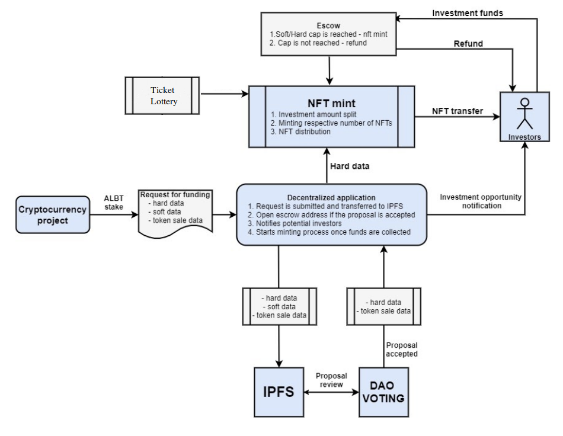

# How projects get financed

The financial flow follows this chart:

## Project funding initial phase
 
1. Company  that is willing to raise money for its blockchain-based project accesses the decentralized AllianceBlock application with a funding request. 
2. Project is requested to stake a respective amount of ALBT tokens in order for dapp to process the application.
3. “Request for funding” needs to be uploaded via a decentralized application according to the predefined format. 
4. Request consist of all the important information on the project divided into three parts: hard data, on which base future NFT token will be minted, project description providing overall info on the project, and token sale data containing all details about token sale. 
5. Request need to be populated into the dapp accurately. Hard data, and token sale data needs to be populated in respective formats, otherwise dapp would not process the application.
6. The submitted application is saved in the IPFS system, where it’s publicly accessible.
7. DAO delegators are reviewing the funding application and voting for the funding acceptance, if the outcome is positive, DAO triggers the funding process and dapp initiatie the smart contract creation that will serve as an escrow to gather and redistribute funds.
8. Once proposal is accepted initial stake is redistributed across the ecosystem.
9. Once a smart contract is created, dapp will list investment opportunities and the information will be sent to the integrated P2P protocols. 
10. Smart contract will be integrated with the Events Monitor that will act as a notification system integrated with off-chain applications (mails, telegram groups) to provide information about investment possibilities. 
11. Investors can provide the funding in an exchange for NFT Investment Token that will entitle them to capitalize on the investment by either receiving project tokens at discount, or investment repayment plus accrued interest rates. 
12. When the project funding process is initiated, the investors have 72 hours for sending funds to the escrow address. Funds are stored and collected till the hard cap is reached. If the soft cap is not reached, funds are sent back to the investors, project funding is cancelled and the project is losing staked ALBT tokens. 
13. Once the hard cap is reached, or soft cap is reached within the 72 hours period. NFT Investment Token mint process is initiated. 

## Project financing  

14. Interested lenders send ALBT tokens to provide funding in order to claim a respective fraction of an NFT Investment Token. 
15. Funds are being transferred from investors to the escrow. On the way, funds are exchanged for the stable coins via ALBT/USDT gateway to avoid investment value fluctuations before being locked in the escrow.
16. Escrow is a smart contract that locks funds, and redistributes them to the project, respectively to achieve milestones. 
17. Every transfer outgoing from the escrow will be processed via integrated DEX to exchange the stablecoin into the currency in which the investment was made . 
18. Transfers sent from escrow to the funded projects are as well processed through ALBT/USDT gateway. Project receives the equivalent of USD value in ALBT tokens and  exchanges it on its own. This will additionally increase ALBT overall trading volume. 
19. As an initial tranche of funds is delivered, the funded project is obliged to repay the funding according to what was submitted in dapp. 
20. There are two types of funding repayment method:
    - investment is repaid with an usd equivalent in any supported tokens plus accrued interest (this option can be chosen by project if they did not have their own token yet. Fe they are collecting funds for seed phase) 
    - Investment is repaid with project tokens provided at pre-agreed discount  (this option can be chosen by project if they are already post token generation event)
    In both option a fraction of repayment is charged by AllianceBlock and redistributed across the ecosystem

## Investment risk mitigation 

21. To mitigate the risk of an investment project is required to to deposit a token collateral equivalent of 200% or more (depending on the project risk profile) of the requested funding value. Funds need to be deposited in the escrow, otherwise smart contracts will not release the first funding tranche. 
22. If the project has not generated a token yet, therefore is unable to deposit token collateral, the project must deposit an initial sum in the ALBT tokens. This information has to be submitted in the dapp application. 
23. If the project will conduct a Token Generation Event after gathering funds using the AllianceBlock product, the token will be involved into a liquidity mining program to support initial liquidity. Project will provide a respective amount of tokens as a mining incentive to make APY attractive for miners.  
24. Funds locked in the escrow will be distributed to the project subject to achieved milestones.
25. As the project will reach the milestones, DAO delegators will vote on unlocking the next tranche for funding. DAO will trigger the funds unlock based on milestones pre-agrees in the Request for funding document.
26. If the project fails to meet pre-agreed milestones DAO is voting on the retain of the funds. Project can provide the explanation of the delay in the form of application submitted through the dapp, that will be reviewed by DAO delegators and voted on if the delay can be accepted or not. 
27. Part of the funds gathered will be used in liquidity mining to provide the NFT holders an extra yield that will be additional income to the interest rates accrued.  
28. If the vote outcome is negative funds are withheld and the dispute resolution process is triggered. 

## Reimbursement process

29. If the project is not able to prove his right during the dispute resolution process, reimbursement is initiated. 
30. Reimbursement process proportionally returns funds locked in the escrow to the investors, additionally the project tokens deposited are automatically liquidated in the market and sent to the investors in the respective currency the investment was made.  
31. If the sum of the remaining investment funds locked in the escrow and the value of the project tokens from the deposit are exceeding the initial amount of the whole investment provided to the project, the remaining amount is sent back to the project, as the whole investment amount is reimbursed to the investors. 
32. If the sum of the remaining investment funds locked in the escrow and the value of the project tokens from the deposit is not sufficient to cover the whole investment, the whole sum of funds are proportionally returned to the investors and investors are facing loss. 

## On-chain investment governance

33. Minted NFT Investment Token is transferred from the smart contract and redistributed proportionally across Investors. Holding of NTF Investment Token will entitled the owner to receive projects token at discount or investment repayment with accrued interest.
34. Part of the tokens deposited by the project in the smart contract and investment funds will be subjected to the liquidity mining program. The profit generated from the yield farming will go to the Investors to generate additional profit. 
35. Smart contract automatically redistributes funds. Investors receive principal repayment and interest rates or project tokens at discount, part of the interest or project tokens is redistributed to the AllianceBlock network stakers and DAO.
36. Once the investment is fully repaid, the NFT Investment Token is burned. 

## Funding NFT Token minting process

1. Once a funding application is accepted, the DAO delegators triggers a smart contract that sends the notification to the investors. 
2. DAO triggers creation of the escrow where funds are being stored and redistributed across the ecosystem. 
3. Investors provide funding in any supported token  calculated per investment unit. Investors are obliged to send the accurate amount of the ALBT tokens that will reflect the respective amount of Investment Units. 
4. Calculation of the investment contribution into Investment Units is a technical requirement for further  creation of a number of NFTs that will allow the investor to sell the part of the investment. 
5. If the soft cap is not reached funds are sent back to the investors. When a soft/hard cap is reached, a smart contract initiates a token minting process. 
6. Smart contract divides the investment amount into multiple NFTs where each is representing equal investment contribution. NFT Investment Tokens are respectively divided between all funding investors. 
7. Each of the investors receives a corresponding NFT amount representing part of the investment. NFT investment token contains funding economics on which base repayment and funding process will be conducted.  
8. NFT Investment Token will keep only funding economic data, other information on the project required for DAO to vote and to trigger funding events will be stored in IPFS.  

## Life cycle of a Funding NFT

