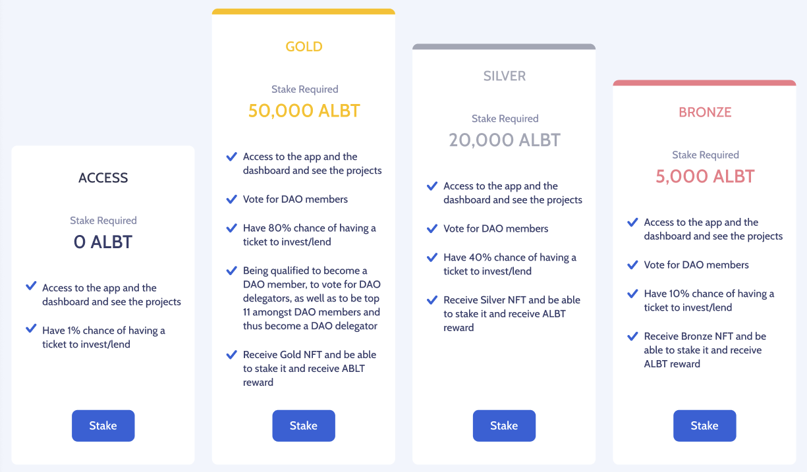

# How Crypto Startup Projects get financed

## Scenario
A project that needs funding to launch an ERC-20 token usually seeks investors. We call this a [Seeker](Glossary.md) Project. The **Seeker** will have to go through several stages in order to receive funding.

---

## From the Seeker's perspective

1. **Request stage:** Seeker will [Request Investment](Glossary.md). This request consist of several parts
    * [Hard data](Glossary.md) regarding the project.
    * A general Project Description.
    * Token sale, previously generated by the **Seeker** on a [TGE](Glossary.md).

2. **Review stage:** The [DAO](DAO.md) will review the **Seeker's request** and decide whether to approve the project for investment or not.
    * If the DAO decides not to approve, the **Seeker** will receive a notification and they will be able to claim back their [project tokens](Glossary.md).
    * If the DAO decides that the project is worth investing in, the **Seeker** will be notified and a **Funding Stage** begins.

3. **Listing stage:** At the start of the funding process, the Project will become [listed](Glossary.md) on the website. Potential [Funders](Glossary.md) will receive a notification via e-mail, encouraging them to sign-in to their accounts and [Subscribing](Glossary.md) to the project.

4. **Subscribing stage:** *Funders* subscribe to a project for a chance at winning a [Funder Ticket](Glossary.md). Subscribing is a declaration of intent to invest a certain amount of assets (generally USDT/USDC/DAI) in a specific project.

At the end of this step, the *Funders* will be required to choose a [Participation Tier](Glossary.md), depending on the amount of **ALBT** they wish to stake.
    * Tier 0 receives 1% of the tickets: users who have declared intent but have not staked any **ALBT**.
    * Tier 1 receives 5% of the tickets: users who have declared intent but have **5k ALBT** staked
    * Tier 2 receives 10% of the tickets: users who have declared intent but have **50k ALBT** staked
    * Tier 3 receives the rest of the tickets: users who have declared intent but have **200k ALBT** staked.

5. **Ticket stage:** Once the subscription (*declaration of intent by the potential funders*) has concluded, the [Registry](Glossary.md) emmits the tickets and distributes them according to the [Participation Tier](Glossary.md). This stage is heavily influenced by the [Reputation Subsystem](RALBT.md).

**Note: within each tier there is a *first-come first-served* distribution of the tickets.**

6. **Funding stage:** When a potential funder receives their [Funder ticket](Glossary.md), they are encouraged to make a payment for at least the total amount they declared in the previous phase. If they do so, they receive a [Funding NFT](Glossary.md), representing their investment in the project.

7. **Claiming stage:** After the project goals have been reached and all of the **Funders** have purchased their **Funding NFT**, the **Funding Stage** is closed. **Funders** are now able to claim the **Project tokens** and Seekers are able to claim their project funding from the [Escrow](Glossary.md)

---

## From the Funder's perspective:

1. Users connect to the platform. Choose how much they want to stake, effectively earning a **Tier NFT**.
2. Users earn [Reputation](Glossary.md)
3. Users become [Subscribers](Glossary.md) by declaring their intention to invest in a project. Then they participate in the [Funding Ticket Lottery](Glossary.md) for a chance at becoming [Funders](Glossary.md)
4. Users become [Funders](Glossary.md) by exchanging their funds for the [Project Tokens](Glossary.md)

---

## Project investment graphical representation

---

## The token flow follows this chart:

