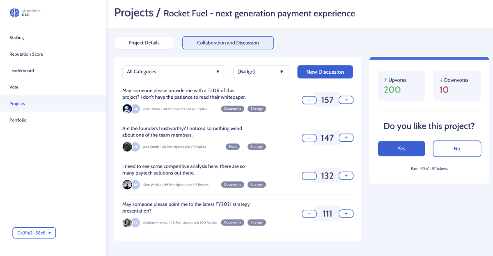
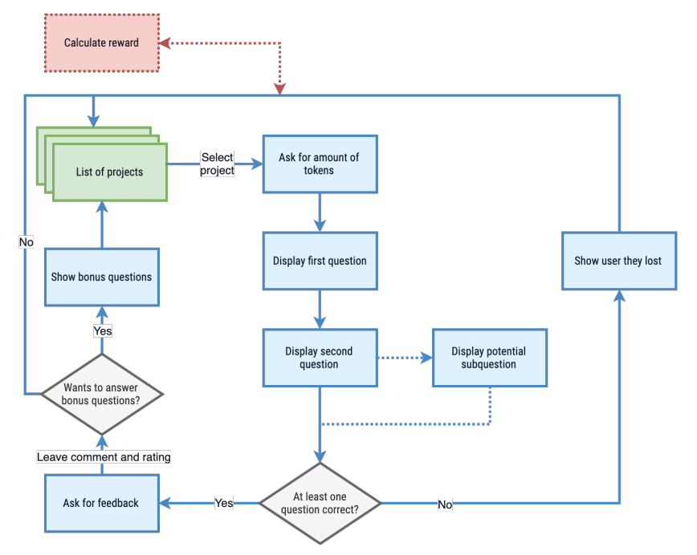

# Reputation

**Reputation** is a key sub-system that permeates the whole P2P protocol. It is measured in ten levels: from **Junior** to **Grand Master**. Users can earn **Reputation** depending on the [Tier](Glossary.md) they picked prior to investing. By interacting with the protocol, users will earn a certain amount of [Reputation Tokens (rALBT)](RALBT.md):

* Applying for a Loan
* Locking their investment (instead of instantly claiming)
* Staking *ALBT*
* Signing messages
* Upvoting / Downvoting projects
* Responding to threads or creating new ones
* Sharing projects and helping them reach more people
* Broadcasting messages on-chain (paying gas fees)
* Playing mini-games (like Trivia)
* ... and more actions TBD by the DAO

## Incentives
Users receive a *reputation reward* when participating in Project evaluations. Their reward is relative to the **rALBT** tokens staked, and the quality of the answers provided. **Reputation** is highly influential in the [Investment Ticket Lottery](Glossary.md), since users with higher *reputation score* will have better chances of winning the lottery and partake in investment opportunities.

Additionally, when a user has **10k rALBT**, they are entitled to claim an [Investment Ticket](Glossary.md) that will automatically win them a chance at the next [Ticket Lottery](Glossary.md). In short, **rALBT** increases your chances of earning an investment opportunity. The more you participate, the better chances you'll have.

### Trivia example
Here's an example of the trivia game flow that will allow users to earn reputation and qualify for rewards, while at the same time providing valuable insights on the projects.

## Protection from whales
There are two major protections implemented:
1) At launch, the `transfer()` functionalities within the [rALBT token](Glossary.md) will be locked, to protect the protocol from whales.
2) The relation between the amount of **Reputation** and the benefits within the platform are equalized by the [GEV Distribution](https://en.wikipedia.org/wiki/Generalized_extreme_value_distribution). This makes the *Reputation curve* asymptotic, discouraging hoarding **rALBT**. In other words: after a certain point, earning more won't have any considerable effect.

On top of that, the [Tier NFTs](Glossary.md) are balanced and each user may have as much as a single *Tier NFT*. This means that wales might own a single **Gold NFT**, equalizing their perks with the rest of the users.

---

## Future updates
* **Reputation markets**: After a grace period has passed and the *Reputation tokens* have converged to a stable system, the [DAO](DAO.md) will enable the `transfer()` of *rALBT*. This will open up the possibilities to trading **Reputation Tokens**. Because of the **GEV Distribution**

* **Reputation Levels**: The user’s level reflects their skills. A user’s level is based on the total tokens earned for each project evaluated and their reputation. To reach a level, the user must pass the thresholds in tokens and reputation. Since the reputation is updated periodically, the level is also updated. A user’s level determines the minimum and maximum tokens involved during the project evaluation. The higher the level is, the higher the number of tokens involved. A better level implies a slightly higher peril but also better rewards. The level thresholds are not linearly spaced. The progression gets more challenging with levels. However, the calibration of these thresholds is designed to ensure that a talented participant can progress effectively.
The user’s progress within a level is easier at the beginning of the level and is slower at the end of the level. The level change is a step to reach and exceed. This progression rate variation within a level is used for the total tokens and reputation, so the user has two progression levers.

* **Project Rating**: Rating represents the collective user's opinion about a project. *The Wisdom of Crowds* by **AllianceBlock** means that each user's **Reputation** plays a role as important as their opinion on an early-stage project.

