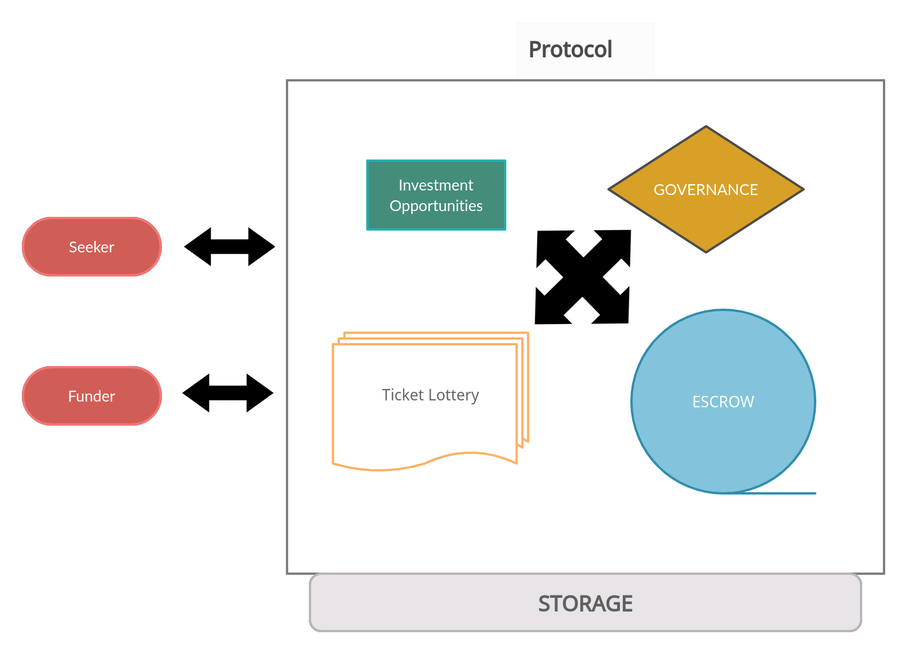

# P2PLINFT

## In a nutshell
AllianceBlock is implementing a decentralized finance model on the principles of participatory capitalism by shifting the functions of validation, rating, and governance from centralized entities to the collective input participants of the ecosystem.

The **Protocol** aims to provide a decentralized infrastructure allowing blockchain-based projects to receive funding from the platform's users as well as from other p2p lenders that have integrated with [AllianceBlock](https://allianceblock.io). Users providing funding (a.k.a. [Funders](Glossary.md)) for a project receive [Funding NTFs](Glossary.md) that represent investments which can be exchanged for the [Project tokens](Glossary.md) at discount, or can be repaid with accrued interest at pre-agreed conditions.

* Read more about the stages for [Project Financing](Financing.md).
* For any definitions you may need, check out our [Glossary](Glossary.md)
* There is also a *FAQ* section [here](FAQ.md)
* *Loan Mechanics* are documented [here](Loans.md)

---

## The Protocol

The protocol is comprised of several parts.
* The [Registry subsystem](Registry.md), handles most of the user's interactions at the core of the protocol.
* The [Governance subsystem](DAO.md), handling all **Governance** interactions, the voting process, and updates to the protocol. The *end-to-end* Governance process is documented [here](DAO-endToEnd.md)
* The [Escrow subsystem](Escrow.md), that acts as an independent intermediary, holding the funds and supporting the financial aspect of the protocol.
* The [Storage subsystem](Storage.md), holds the hard data for every loan, project or investment.
* The [Reputation subsystem](Reputation.md), that runs through and affects almost every level of the protocol.

## How it works

First, the different token contracts and interfaces that are implemented and/or used are described to understand the tokenomics. Tokens are used as collateral, to give out and pay back loans, to represent ownership of a lender, and to stake to take part in the protocol’s governance.
Then the contracts that orchestrate the interactions between these different tokens and between different actors will be presented as well to understand the complete flow and know all available (external) transactions.

The code of the smart contracts that are currently developed for the p2p, the decentralized lending platform permits **Seekers**(a.k.a. *Borrowers*) to request a personal loan or a loan for a project.
Both will follow these steps:
* As a guarantee, collateral tokens of the **seeker** will be deposited in escrow when requesting the loan.
* Dao delegators can then vote to approve the loan requests.
Once a loan is approved, lenders can fund the loan by transferring lending tokens they hold.
* In exchange they will get loan NFT Notes representing the partitions of the loan they funded and making them eligible to claim the repayments of the loan with interest.

The total amount of a personal loan, once completely funded, is fully available to the **seeker** and can be paid back in batches. On the other hand, project loans will only get a part of the loan for every project milestone that gets delivered. Delegators have to vote to accept the delivery of a milestone. Repayment of project loans is done in one part of the total amount of the loan with interests once all milestones are delivered.
When a **seeker** does not comply with paying the repayment batches on time or if a project does not deliver a milestone in the agreed-upon time, the loan can be challenged which can lead to loss of the collateral token for the **seeker**.

