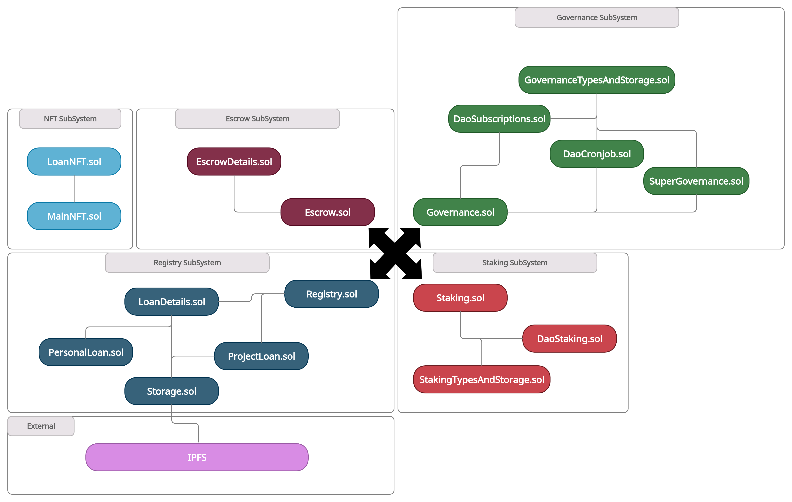

# Smart Contracts

### Governance
Responsible for handling the current Subscribers and Delegators, as well as voting their functionality.

### Registry
The central point of control for the P2P ecosystem. Responsible for starting, approving, rejecting [Investment IDOs](Glossary.md#ido), executing payments (e.g. a [Seeker](Glossary.md#seeker)), receiving payments (e.g. a [Funder](Glossary.md#funder) participating in the [Ticket Lottery](Glossary.md#funder-ticket)).

### InvestmentDetails
An extension that includes modifiers and logic to interact with the storage, holding critical information for each [Investment](Glossary.md#ido)

### Storage
This is an extension responsible for storing all the needed mappings for the investments as well as the external contract addresses and contract internal values.

### Investment
An extension that includes all functionality to do with all Investments That includes the logic for calculating and initializing the investment, accepting payments, dealing with [Seekers](Glossary.md#seeker), and many more.

### FundingNFT
[ERC1155](Glossary.md#erc-1155) contract for the representation of the individual parts of a tokenized investment opportunity.

### Escrow
Responsible for keeping all of the NFTs and funds away from the registry itself. No logic in here apart from the ability to withdraw and receive the funds and NFTs.

### Staking
Responsible for managing the staked funds deposited by users who wish to gain [Reputation](Reputation.md)