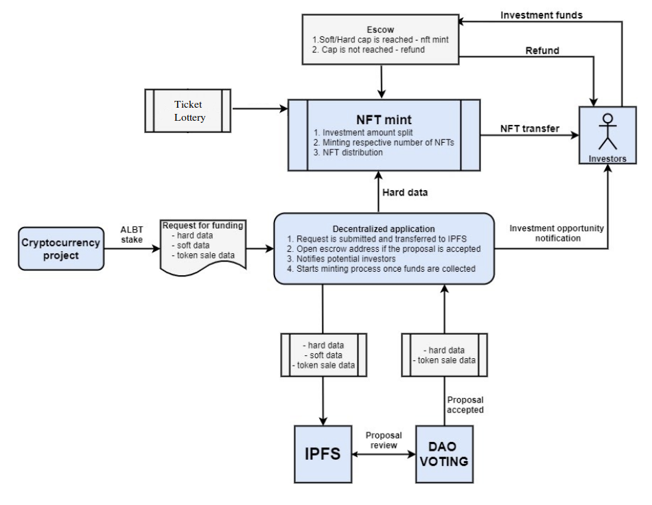
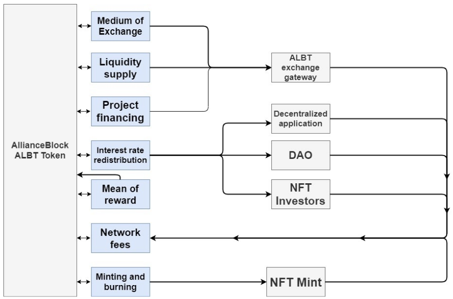

# Tokenomics

## Funding NFT Token minting process

1. Once a funding application is accepted, the DAO delegators triggers a smart contract that sends the notification to the investors. 
2. DAO triggers creation of the escrow where funds are being stored and redistributed across the ecosystem. 
3. Investors provide funding in any supported token  calculated per investment unit. Investors are obliged to send the accurate amount of the ALBT tokens that will reflect the respective amount of Investment Units. 
4. Calculation of the investment contribution into Investment Units is a technical requirement for further  creation of a number of NFTs that will allow the investor to sell the part of the investment. 
5. If the soft cap is not reached funds are sent back to the investors. When a soft/hard cap is reached, a smart contract initiates a token minting process. 
6. Smart contract divides the investment amount into multiple NFTs where each is representing equal investment contribution. NFT Investment Tokens are respectively divided between all funding investors. 
7. Each of the investors receives a corresponding NFT amount representing part of the investment. NFT investment token contains funding economics on which base repayment and funding process will be conducted.  
8. NFT Investment Token will keep only funding economic data, other information on the project required for DAO to vote and to trigger funding events will be stored in IPFS.  

## Life cycle of a Funding NFT

1. Investors are informed on the token sale details containing information on how much ALBT token is required per one Investment Unit.
2. Investment is calculated into Investment Units in order to have further flexibility in trading parts of the investments. 
3. Investors are sending to the escrow the pre-calculated amount of ALBT  reflecting the accurate number of the investment units.
4. Funds are exchanged into stablecoins and locked in the escrow. 
5. Escrow smart contract triggers the NFT mint process.
6. Smart contract creates a respective number of ERC1155 tokens, each representing a part of the investment..
7. NFT Investment Tokens are distributed according to the investor. Each investor receives the NFT amount equal to the number of the Investment Units.
8. NFTs hold rights to receive repayment plus interest rates or project tokens at discounted price. NFTs can be traded, wrapped and leveraged across different blockchains and DeFi applications.

## Funding NFT context

## AllianceBlock Token (ALBT) usage

[ALBT token](Glossary.md) will be the main medium of exchange, used for providing and receiving funding, as well as for paying all the fees required to operate on a platform. If Project will repay the funding with project tokens, the tokens will be exchanged automatically to ALBT tokens to be redistributed across the ecosystem. The volatility issue would be resolved by pegging ALBT tokens with Ethereum based stable coins. 

* **Mean of reward** - all network participants will be incentivized for maintaining the network.

* **Liquidity supply** - ALBT token will be the currency paired with other coins in order to generate extra yield from the coins stored in the Escrow.  

* **Project financing** - financing will be issued in ALBT tokens and converted into stable coins through an exchange  gateway. 

* **Interest rate redistribution** - interest rate distribution will be done using ALBT tokens. If interest rates would be paid in project tokens, they will be converted from into ALBT token via exchange gateway. 

* **Network fees** - every transaction will require to pay a small portion of fees in the form of
ALBT token. 

* **Minting and burning NFT** - minting and burning NFTs will use a small portion of ALBT token

* **Integrators** - Integrated platform use ALBT token exclusively when interacting with NFT Marketplace

